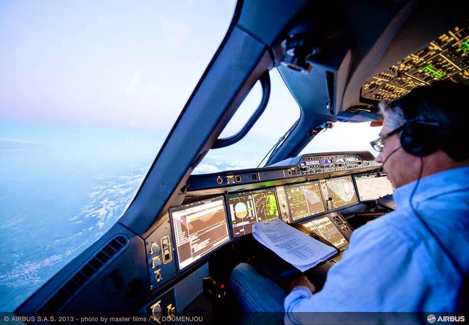

# Hypoxia-Induced Speech Slurring Classification

A deep learning approach to classify hypoxia-induced slurring in pilot's speech using Convolutional Neural Networks.



### Cabin Pressure and Aviation Safety
Commercial aircraft cabins are pressurized to allow passengers to breathe comfortably at high altitudes. These aircraft have sophisticated systems to monitor cabin pressure and oxygen levels, with automated safety features like oxygen mask deployment during depressurization events.

However, in smaller aircraft and particularly military aircraft, the warning systems are not as sophisticated. Pilots are responsible for monitoring cabin pressure and oxygen levels themselves. While pilots are trained to recognize hypoxia symptoms, they are not always immediately obvious to those experiencing them.

### The Problem of Hypoxia
Hypoxia occurs when the body doesn't get enough oxygen. One common symptom of hypoxia is the slurring of speech (medically known as dysarthria). During hypoxia incidents, air traffic controllers often notice the pilot's speech becoming progressively more slurred before they realize there might be a problem.

## Project Overview
This project implements a Convolutional Neural Network to classify speech as either dysarthric or non-dysarthric

### Technical Implementation
- Uses the TORGO Dataset for training
- Implements feature extraction including:
  - MFCC features with deltas
  - Spectral features (centroid, bandwidth, rolloff)
  - Chroma features
  - Zero crossing rate
- Employs a CNN architecture for classification
- Achieves 95% accuracy with balanced precision and recall across both classes

## Results
- Accuracy: 95%
- Precision: 0.95 (both classes)
- Recall: 0.95 (both classes)
- F1-Score: 0.95
- AUC: 0.9941

## Installation and Running with uv

This project uses [uv](https://github.com/astral-sh/uv) for fast Python dependency management and isolated environments.

### 1. Install uv
If you don't have `uv` installed, you can install it via pip:

```bash
pip install uv
```

Or, for the latest version, follow the instructions on the [uv GitHub page](https://github.com/astral-sh/uv#installation).

### 2. Install Dependencies
From the project root directory, run:

```bash
uv venv
uv pip install -r requirements.txt  # or use 'uv pip install .' if using pyproject.toml only
```

This will create a virtual environment and install all dependencies.

### 3. Activate the Environment

On macOS/Linux:
```bash
source .venv/bin/activate
```
On Windows:
```bash
.venv\Scripts\activate
```

### 4. Run the Project
- To launch the Jupyter notebook:
  ```bash
  uv pip install notebook  # if not already installed
  jupyter notebook
  ```
- Or, run your scripts as needed:
  ```bash
  python your_script.py
  ```